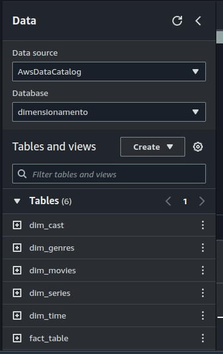
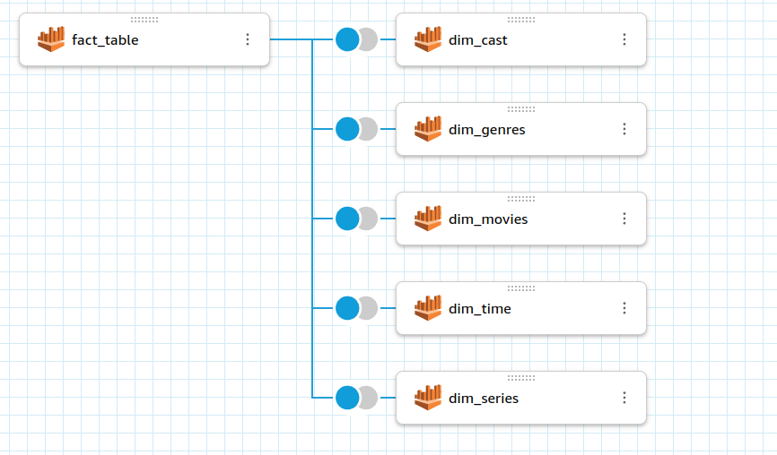
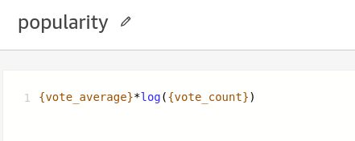
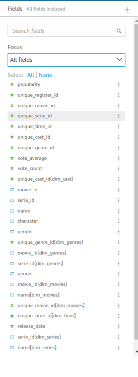

# Sprint 10

## [Desafio](./Desafio/Readme.md)

## 

## Evidencias

### Tabelas no athena

### Relacionamento das tabelas

### Criação de colunas adicionais

### Colunas finais

### [Dashboard pronto](./Desafio/quicksight_correto.pdf)
