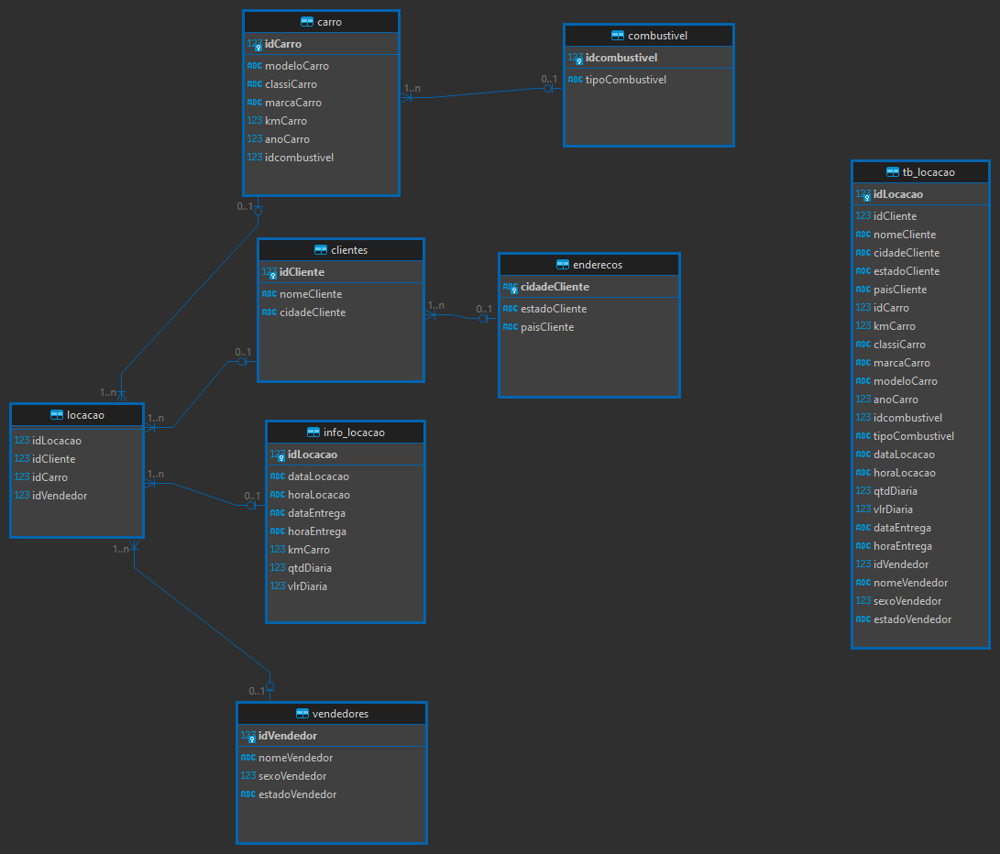
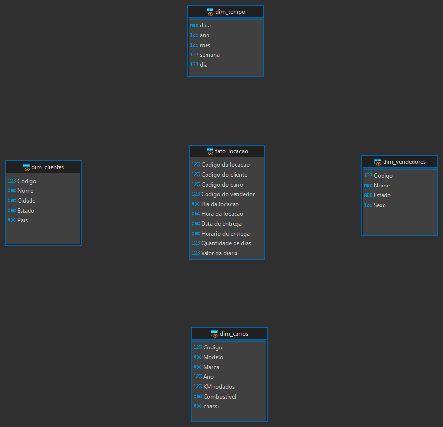
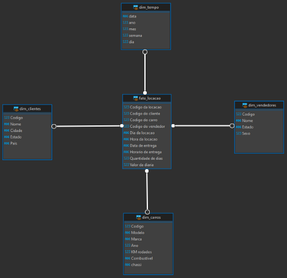

# Sprint 2

## Certificados

## [Desafio](./Desafio/README.md)

## Evidencias

### Tabelas que foram criadas com o uso da primeira parte do script:

### Views que foram criadas com a segunda parte do script

### Views interligadas

### O script completo no DBeaver

## Exercicios

### Seção 3

[Resoluções](./Exercicios/Seção%203/Resoluções.sql)

### Seção 4

[Resoluções](./Exercicios/Seção%204/Resoluções.sql)

### Seção 6

[Resolução etapa 1](./Exercicios/Seção%206/Etapa%201)

[Resolução etapa 2](./Exercicios/Seção%206/Etapa%202)

[Arquivo gerado etapa 1](./Exercicios/Seção%206/Seção%201.csv)

[Arquivo gerado etapa 2](./Exercicios/Seção%206/Seção%202.csv)