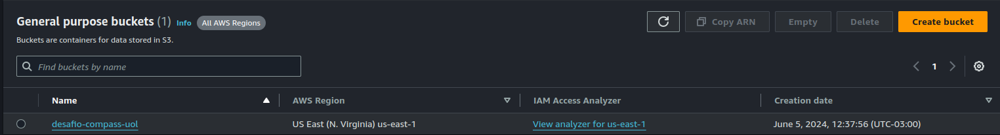
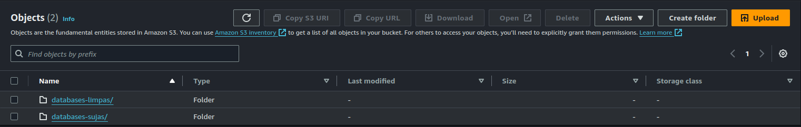
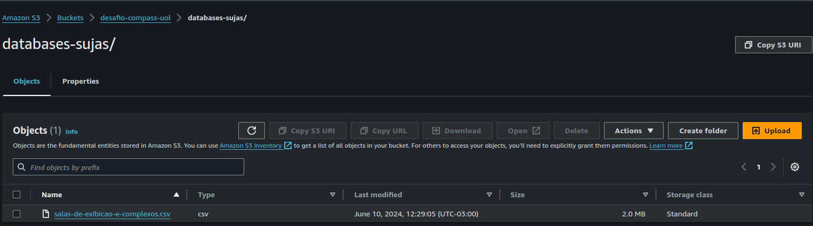

# Sprint 2

## [Desafio](./Desafio/Readme.md)

## Certificados

## Evidencias

### Scripts 

#### Script para limpeza dos dados

#### Script para execução do S3_select

#### Script SQL

### Execução dos scripts

### Organização do S3_bucket

