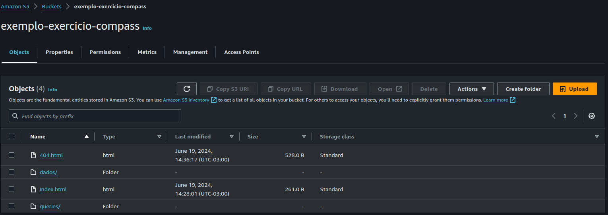
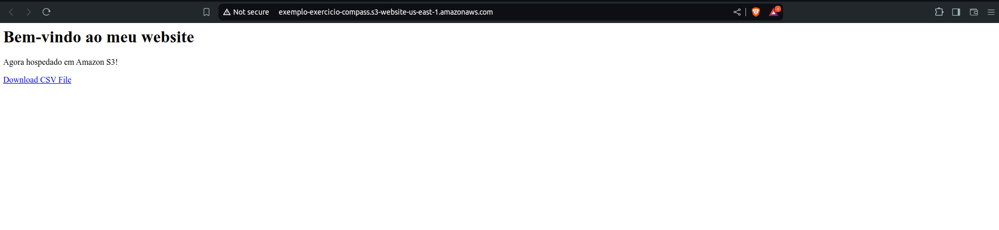
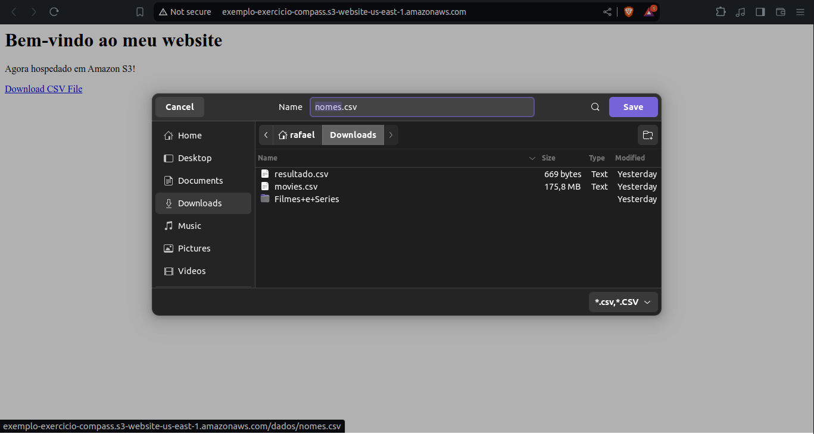
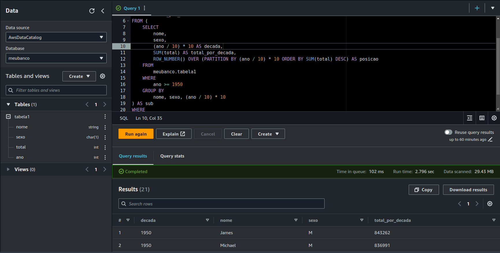
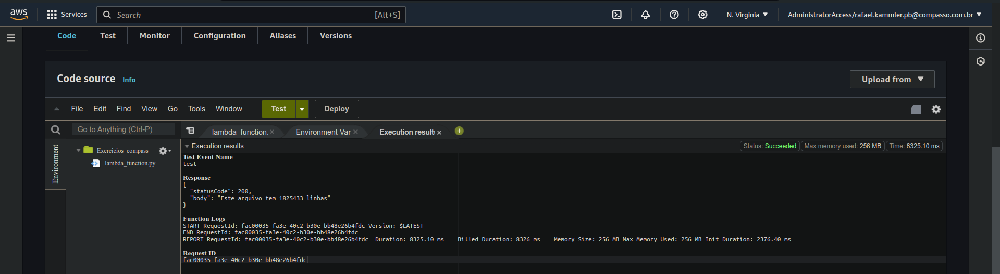

# Exercicios

## Lab 1

### Bucket criado

### Site estático funcionando

## Lab 2

### Arquivos utilizados

#### [Script sql](./Exercicio_2/Script.sql)

#### [Resultado gerado](./Exercicio_2/resultado.csv)

### Código no athena

## Lab 3

### [Script python utilizado](./Exercicio_3/Script.py)