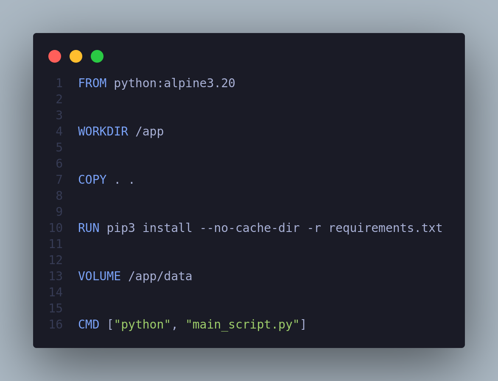
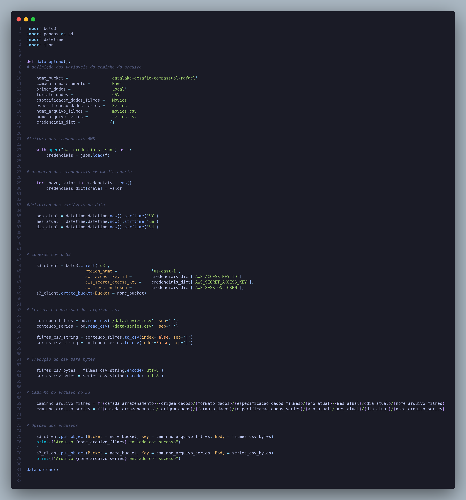
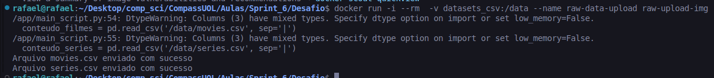

# Sprint 2

## [Desafio](./Desafio/Readme.md)

## Certificados

## Evidencias

### Scripts 

### Execução dos scripts

#### Imagem sendo criada

#### Container sendo executado

### Componentes docker criados

#### Imagem criada

#### Volume criado

### Arquivos no S3_bucket

#### Caminho filmes

#### Caminho séries

## [Exercicios](./Exercicios/Readme.md)

