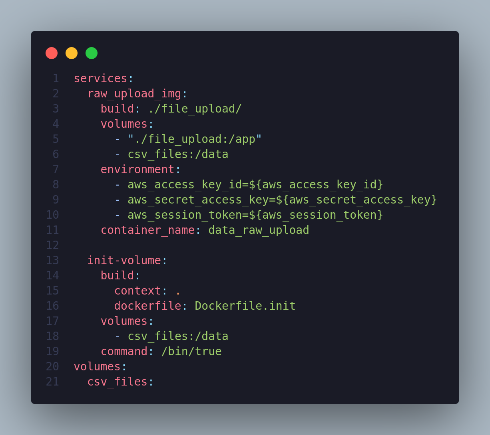
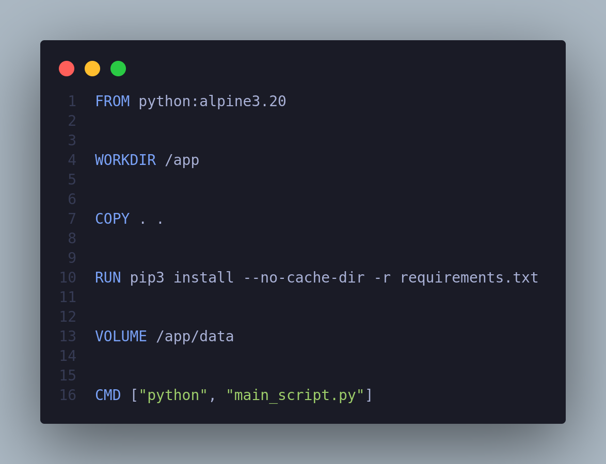
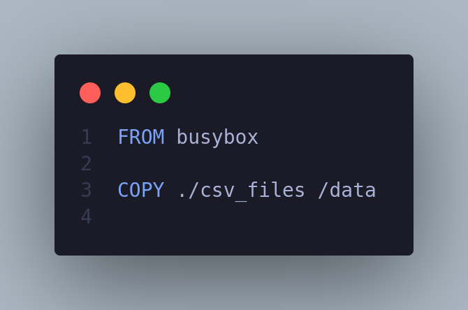
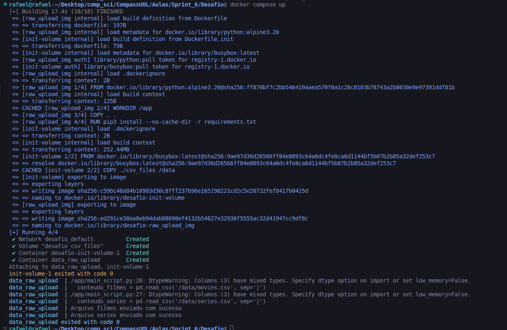
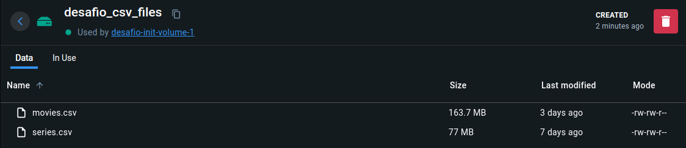
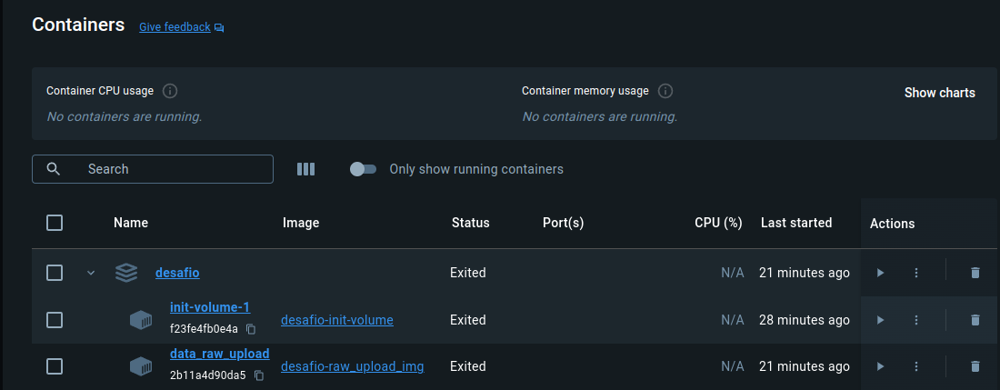
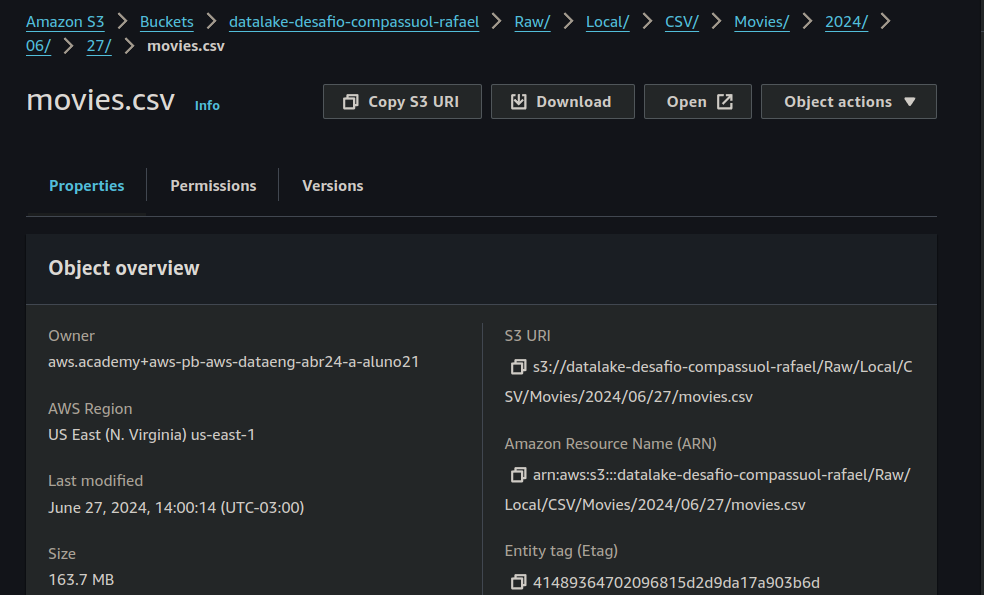
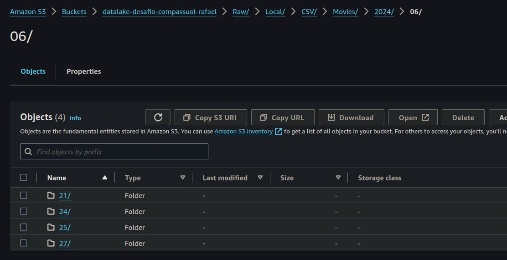

# Sprint 2

## [Desafio](./Desafio/Readme.md)

## Certificados

## Evidencias

### Scripts 

### Execução dos scripts

#### Inicialização do volume com os csv_files

#### Execução docker-compose

#### Reexecução container

### Componentes docker criados

#### Imagem criada

#### Volume criado

#### Containers criados

### Arquivos no S3_bucket

#### Caminho filmes

#### Caminho séries

## [Exercicios](./Exercicios/Readme.md)

