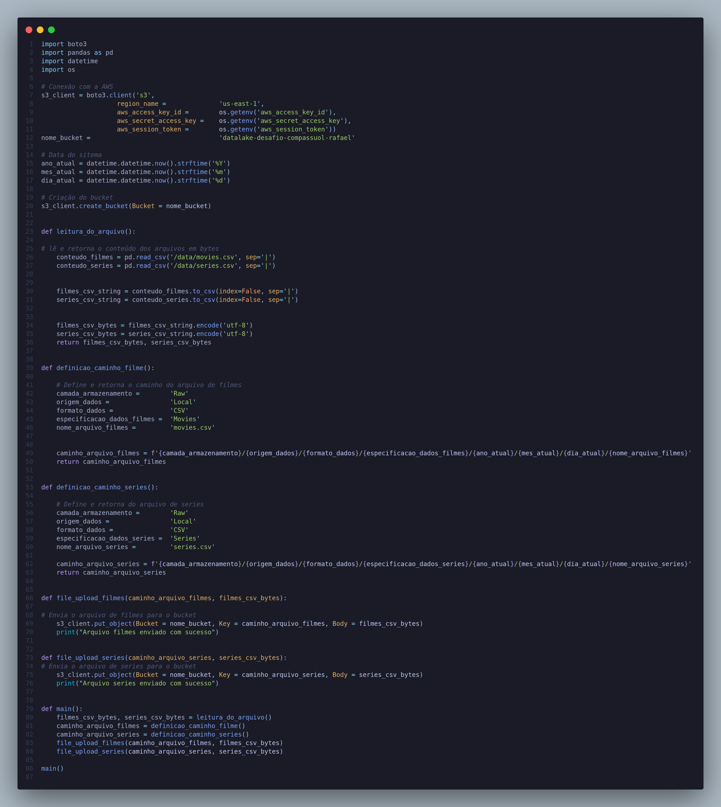
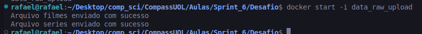
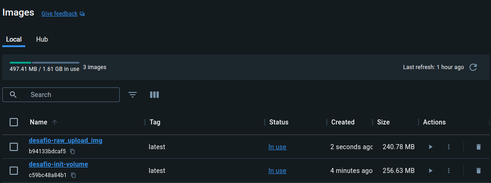

# Sprint 2

## [Desafio](./Desafio/Readme.md)

## Certificados

## Evidencias

### Scripts 

#### Docker compose 

#### Dockerfile

#### Dockerfile.init

#### Script python

### Execução dos scripts

#### Execução docker-compose

#### Reexecução container

### Componentes docker criados

#### Imagem criada

#### Volume criado

#### Containers criados

### Arquivos no S3_bucket

#### Caminho filmes

#### Caminho séries

#### Diversos arquivos enviados

## [Exercicios](./Exercicios/Readme.md)

