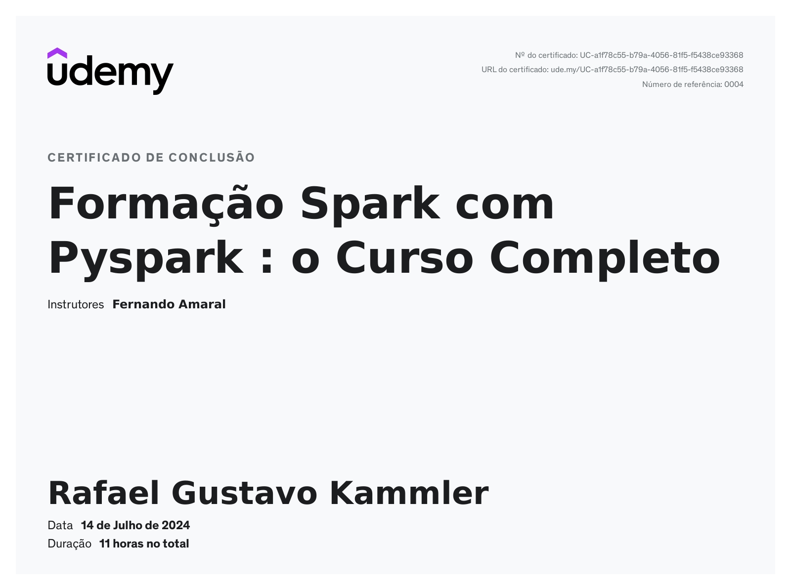
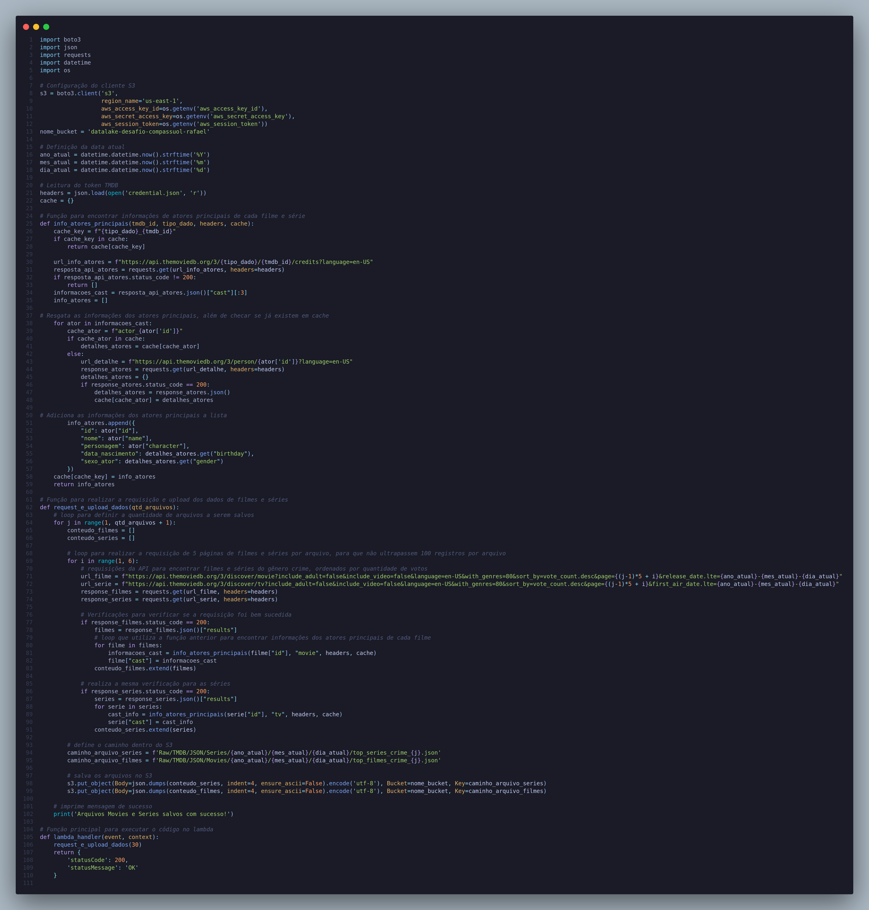
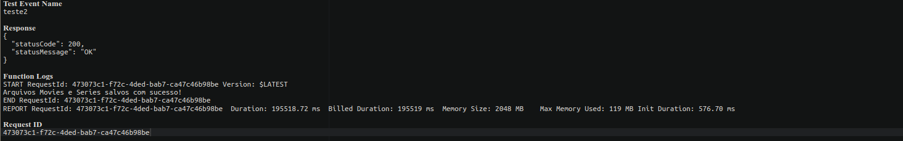
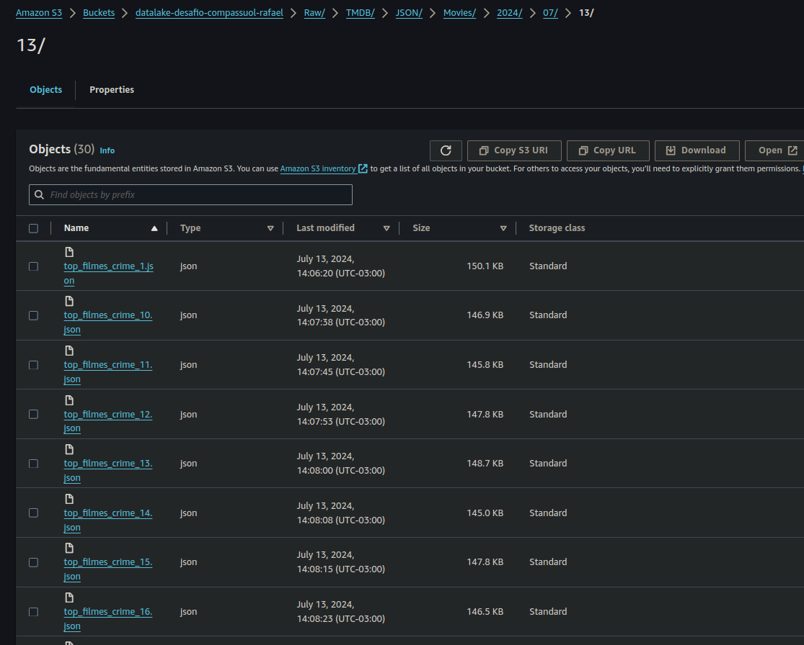

# Sprint 2

## [Desafio](./Desafio/Readme.md)

## Certificados

## Evidencias

### Script Python para o Lambda

### Execução bem sucedida e arquivos no S3

## [Exercicios](./Exercicios/Readme.md)