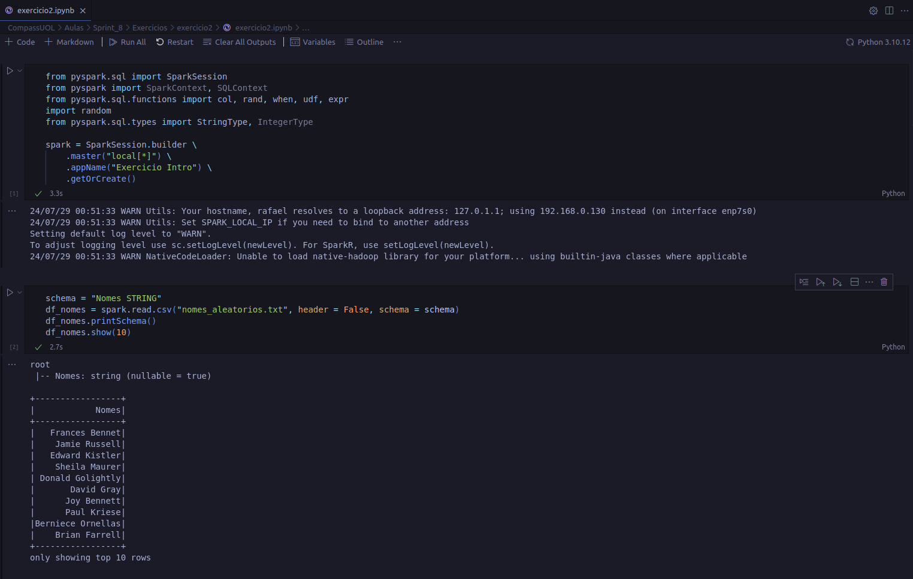
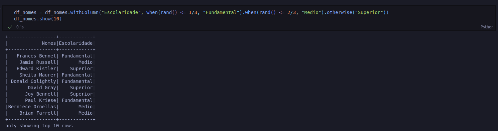
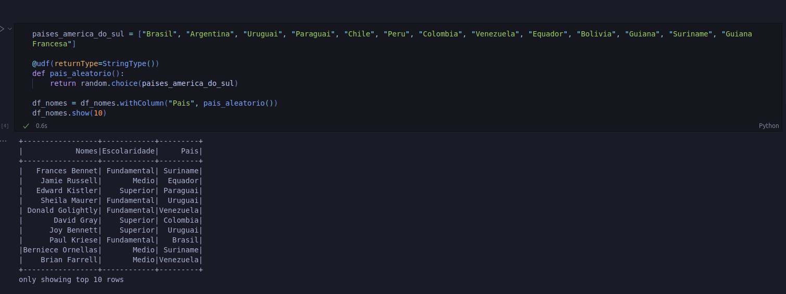
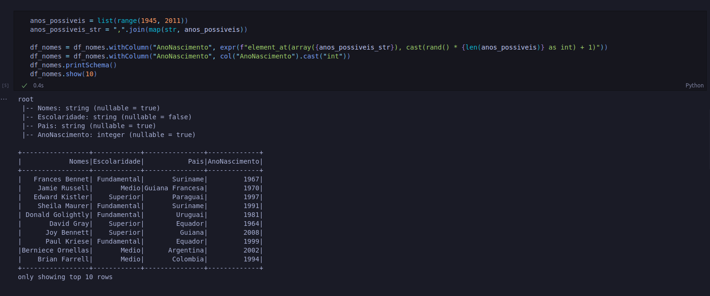
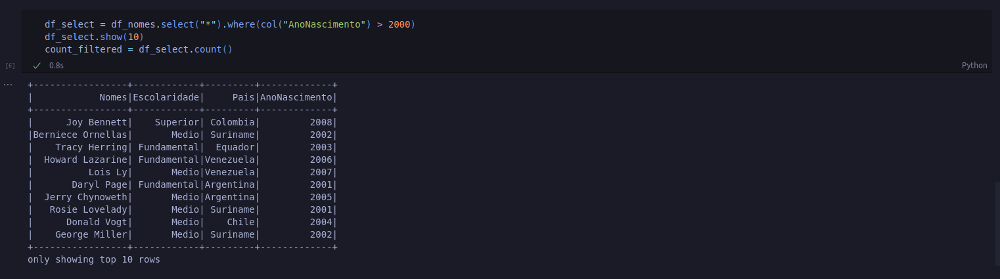
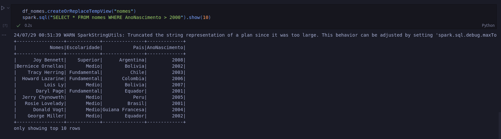
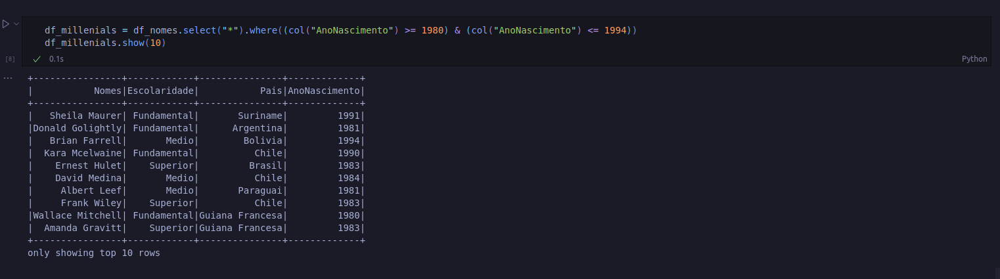
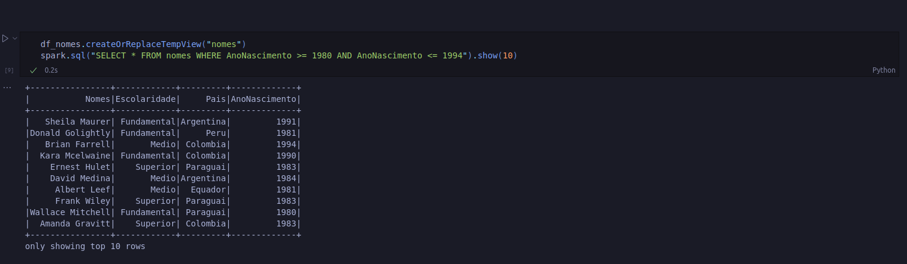
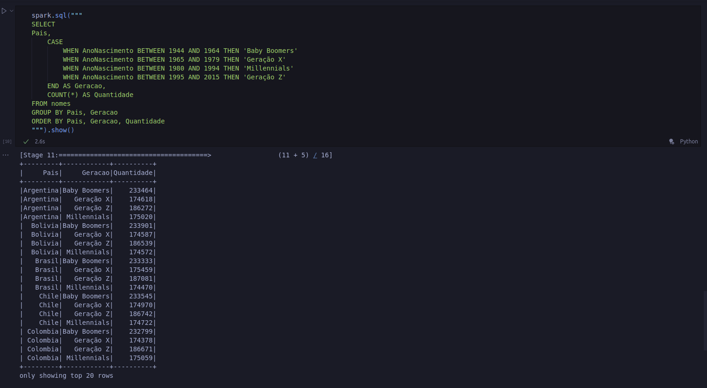

# Exercícios

## Exercício 1 - Geração de Dados

### [Script python](./Exercicio_geracao_e_masssa_de_dados/script_completo.py)

## Exercício 2 - Apache Spark

### [Script Completo](./Exercicio_spark/exercicio2.ipynb)

## Exercício 3 - API do TMDB

### [Script Completo](./Exercicio_API_TMDB/codigo_conexao.py)

